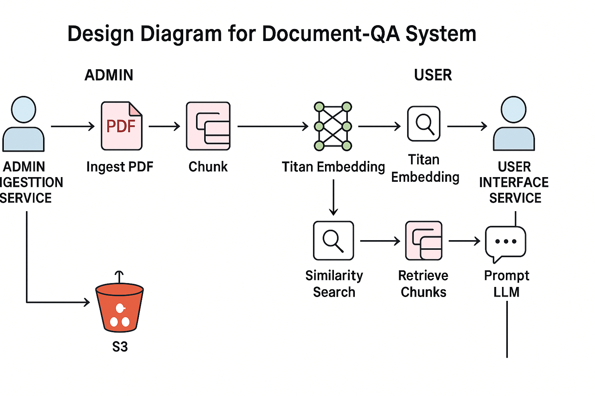

# ChatPDF: Pdf Q&A using RAG

## Overview
A PDF Q&A application built with AWS Bedrock, LangChain, and FAISS. It provides:
- **doc-qa-ingestor**: Ingest PDFs, chunk text, generate embeddings via Amazon Titan Embedding G1, and upload FAISS index to S3.
- **doc-qa-interface**: Download FAISS index, convert queries to embeddings, retrieve relevant chunks, and generate answers using Anthropic Claude 2.1.

## System Architecture



## Prerequisites
- **AWS services**:
  - Amazon Bedrock (Titan Embedding, Anthropic Claude)
  - Amazon S3 (vector store for FAISS index)
  - IAM role with `s3:GetObject`, `s3:PutObject` permissions

- **Local**: Docker, AWS CLI configured

## Build & Run

### 1. Ingest Service (doc-qa-ingestor)
```bash
cd doc-qa-ingestor
# build
docker build -t doc-qa-ingestor .
# run (mount AWS credentials)
docker run \
  -e BUCKET_NAME=<YOUR_S3_BUCKET> \
  -v ~/.aws:/root/.aws \
  -p 8083:8083 \
  -it doc-qa-ingestor
```
- Open: http://localhost:8083 to upload PDFs.

### 2. Query Service (doc-qa-interface)
```bash
cd doc-qa-interface
# build
docker build -t doc-qa-interface .
# run
docker run \
  -e BUCKET_NAME=<YOUR_S3_BUCKET> \
  -v ~/.aws:/root/.aws \
  -p 8084:8084 \
  -it doc-qa-interface
```
- Open: http://localhost:8084 to chat with ingested PDFs.
